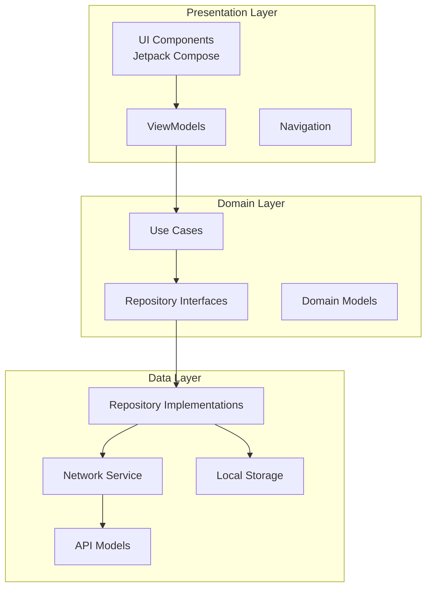
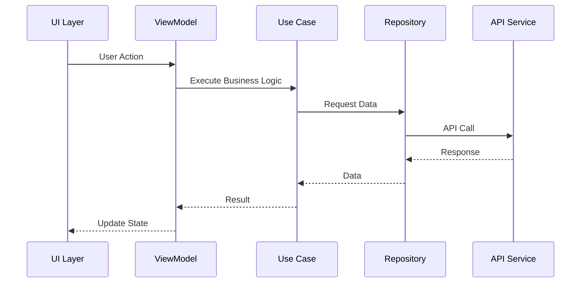

# 🛍️ Ecommerce Shopper App

[](https://developer.android.com/)
[](https://kotlinlang.org/)
[](https://developer.android.com/jetpack/compose)
[](https://blog.cleancoder.com/uncle-bob/2012/08/13/the-clean-architecture.html)

> A modern, scalable Android e-commerce application built with Clean Architecture principles and cutting-edge Android development technologies.

## 📱 Project Overview

**Ecommerce Shopper App** is a feature-rich mobile shopping application that provides users with a seamless online shopping experience. Built with modern Android development practices, it showcases best practices in mobile app architecture, UI/UX design, and code organization.

### ✨ Key Features

- 🔐 **User Authentication** - Secure login and registration
- 🏠 **Smart Home Screen** - Personalized product recommendations
- 🛍️ **Product Catalog** - Browse categories and products
- 🛒 **Shopping Cart** - Add, remove, and manage items
- 📋 **Order Management** - Track order history and status
- 📍 **Address Management** - Multiple shipping addresses
- 💳 **Secure Checkout** - Streamlined payment process
- 🎨 **Modern UI/UX** - Material Design 3 with beautiful animations

## 🏗️ Architecture Overview

This project follows **Clean Architecture** principles, ensuring separation of concerns, testability, and maintainability.



### 🧩 Module Structure

```
📁 EcommerceApp/
├── 📁 data/                    # Data Layer
│   ├── 📁 di/                  # Dependency Injection
│   ├── 📁 model/               # Data Models & API Responses
│   ├── 📁 network/             # Network Implementation
│   └── 📁 repository/          # Repository Implementations
├── 📁 domain/                  # Domain Layer
│   ├── 📁 di/                  # Domain DI Modules
│   ├── 📁 model/               # Domain Models
│   ├── 📁 repository/          # Repository Interfaces
│   └── 📁 usecase/             # Business Logic Use Cases
└── 📁 presentation/            # Presentation Layer
    ├── 📁 di/                  # Presentation DI
    ├── 📁 navigation/          # Navigation Components
    ├── 📁 ui/                  # UI Components
    │   ├── 📁 feature/         # Feature Screens
    │   └── 📁 theme/           # App Theme & Styling
    └── 📁 utils/               # Utility Classes
```

## 🛠️ Tech Stack

### **Core Technologies**
- **Language**: [Kotlin](https://kotlinlang.org/) - Modern, concise, and safe programming language
- **Minimum SDK**: API 24 (Android 7.0)
- **Target SDK**: API 34 (Android 14)
- **Build System**: [Gradle](https://gradle.org/) with Kotlin DSL

### **UI & Navigation**
- **UI Framework**: [Jetpack Compose](https://developer.android.com/jetpack/compose) - Modern declarative UI toolkit
- **Navigation**: [Navigation Compose](https://developer.android.com/jetpack/compose/navigation) - Type-safe navigation
- **Theme**: [Material Design 3](https://m3.material.io/) - Latest Material Design guidelines
- **Fonts**: [Poppins](https://fonts.google.com/specimen/Poppins) - Modern, readable typography

### **Architecture & Dependencies**
- **Architecture Pattern**: [Clean Architecture](https://blog.cleancoder.com/uncle-bob/2012/08/13/the-clean-architecture.html)
- **Dependency Injection**: [Koin](https://insert-koin.io/) - Lightweight DI framework
- **State Management**: [ViewModel](https://developer.android.com/topic/libraries/architecture/viewmodel) + [StateFlow](https://developer.android.com/kotlin/flow/stateflow-and-sharedflow)
- **Async Operations**: [Coroutines](https://kotlinlang.org/docs/coroutines-overview.html) + [Flow](https://kotlinlang.org/docs/flow.html)

### **Networking & Data**
- **HTTP Client**: [Ktor](https://ktor.io/) - Modern async HTTP client
- **JSON Parsing**: [Kotlinx Serialization](https://github.com/Kotlin/kotlinx.serialization)
- **Image Loading**: [Coil](https://coil-kt.github.io/coil/) - Efficient image loading

### **Testing**
- **Unit Testing**: [JUnit 5](https://junit.org/junit5/) + [Mockito](https://site.mockito.org/)
- **UI Testing**: [Espresso](https://developer.android.com/training/testing/espresso)
- **Dependency Injection Testing**: [Koin Test](https://insert-koin.io/docs/testing/testing)

## 🚀 Getting Started

### **Prerequisites**
- [Android Studio](https://developer.android.com/studio) (Hedgehog or later)
- [JDK 17](https://adoptium.net/) or higher
- Android SDK API 34
- Git

### **Installation**

1. **Clone the repository**
   ```bash
   git clone https://github.com/jhaji246/Ecommerce-Shopper.git
   cd Ecommerce-Shopper
   ```

2. **Open in Android Studio**
   - Launch Android Studio
   - Select "Open an existing project"
   - Navigate to the cloned directory and select it

3. **Sync and Build**
   - Wait for Gradle sync to complete
   - Build the project (Build → Make Project)
   - Run on an emulator or physical device

### **Build Variants**
- **Debug**: Development build with debugging enabled
- **Release**: Production build with optimizations

## 📱 Screenshots

## 🔧 Configuration

### **Environment Setup**
The app is configured to work with a backend API. Update the following configurations:

```kotlin
// data/src/main/java/com/avi/data/di/NetworkModule.kt
const val BASE_URL = "https://your-api-endpoint.com/"
```

### **Build Configuration**
Key build configurations are defined in:
- `gradle/libs.versions.toml` - Dependency versions
- `build.gradle.kts` - Project-level build config
- `*/build.gradle.kts` - Module-level build config

## 🧪 Testing

### **Run Tests**
```bash
# Unit Tests
./gradlew test

# Instrumented Tests
./gradlew connectedAndroidTest

# All Tests
./gradlew check
```

### **Test Coverage**
```bash
./gradlew jacocoTestReport
```

## 📦 Dependencies

### **Core Dependencies**
```kotlin
// Jetpack Compose
implementation("androidx.compose.ui:ui:1.5.4")
implementation("androidx.compose.material3:material3:1.1.2")
implementation("androidx.compose.ui:ui-tooling-preview:1.5.4")

// Navigation
implementation("androidx.navigation:navigation-compose:2.7.5")

// Dependency Injection
implementation("io.insert-koin:koin-android:3.5.0")
implementation("io.insert-koin:koin-androidx-compose:3.5.0")

// Networking
implementation("io.ktor:ktor-client-android:2.3.7")
implementation("io.ktor:ktor-client-content-negotiation:2.3.7")
```

## 🏛️ Architecture Principles

### **Clean Architecture Benefits**
- **Separation of Concerns**: Clear boundaries between layers
- **Testability**: Easy to unit test business logic
- **Maintainability**: Changes in one layer don't affect others
- **Scalability**: Easy to add new features and modules

### **SOLID Principles**
- **Single Responsibility**: Each class has one reason to change
- **Open/Closed**: Open for extension, closed for modification
- **Liskov Substitution**: Subtypes are substitutable
- **Interface Segregation**: Clients depend on specific interfaces
- **Dependency Inversion**: High-level modules don't depend on low-level modules

## 🔄 Data Flow



## 🚧 Development Roadmap

### **Phase 1: Core Features** ✅
- [x] User authentication
- [x] Product browsing
- [x] Shopping cart
- [x] Basic navigation

### **Phase 2: Enhanced Features** 🚧
- [ ] Payment integration
- [ ] Push notifications
- [ ] Offline support
- [ ] Search functionality

### **Phase 3: Advanced Features** 📋
- [ ] AR product preview
- [ ] Social features
- [ ] Analytics dashboard
- [ ] Multi-language support

## 🤝 Contributing

We welcome contributions! Please follow these steps:

1. Fork the repository
2. Create a feature branch (`git checkout -b feature/AmazingFeature`)
3. Commit your changes (`git commit -m 'Add some AmazingFeature'`)
4. Push to the branch (`git push origin feature/AmazingFeature`)
5. Open a Pull Request

### **Code Style Guidelines**
- Follow [Kotlin Coding Conventions](https://kotlinlang.org/docs/coding-conventions.html)
- Use meaningful variable and function names
- Add comprehensive unit tests
- Document complex business logic

## 📄 License

This project is licensed under the MIT License - see the [LICENSE](LICENSE) file for details.

## 👨‍💻 Author

**Abhilash Kumar Jha**
- GitHub: [@jhaji246](https://github.com/jhaji246)
- Project: [Ecommerce-Shopper](https://github.com/jhaji246/Ecommerce-Shopper)

## 🙏 Acknowledgments

- [Android Developers](https://developer.android.com/) for excellent documentation
- [Jetpack Compose](https://developer.android.com/jetpack/compose) team for the amazing UI toolkit
- [Material Design](https://m3.material.io/) for design guidelines
- [Koin](https://insert-koin.io/) team for lightweight dependency injection

## 📞 Support

If you have any questions or need help:

- 🐛 **Bug Reports**: [Create an Issue](https://github.com/jhaji246/Ecommerce-Shopper/issues)
- 💡 **Feature Requests**: [Create an Issue](https://github.com/jhaji246/Ecommerce-Shopper/issues)
- 📧 **Contact**: Open an issue or reach out through GitHub

---

<div align="center">
  <p>Made with ❤️ by <a href="https://github.com/jhaji246">Abhilash Kumar Jha</a></p>
  <p>⭐ Star this repository if you found it helpful!</p>
</div>
